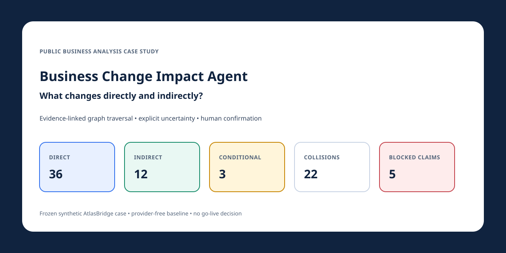
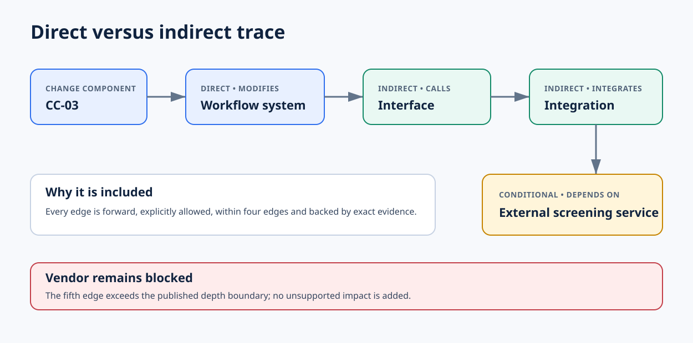
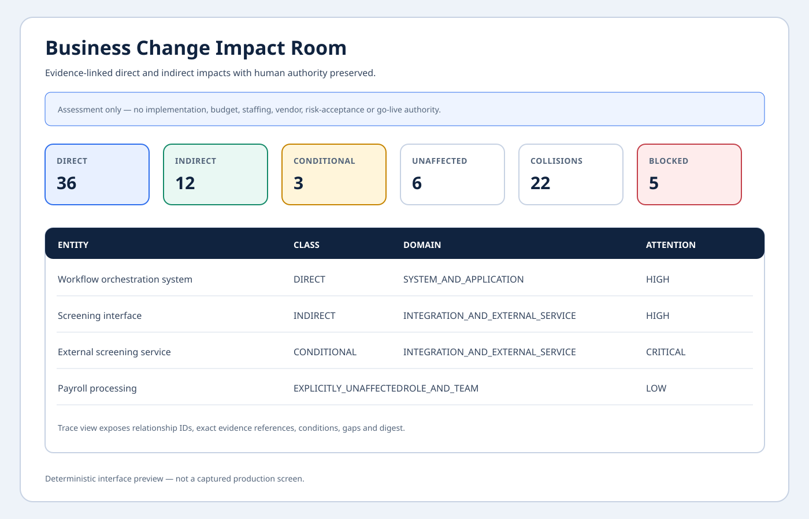
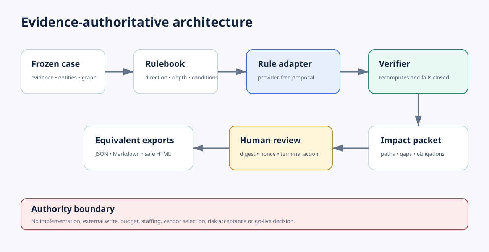
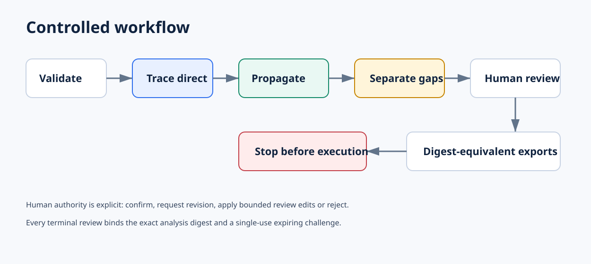
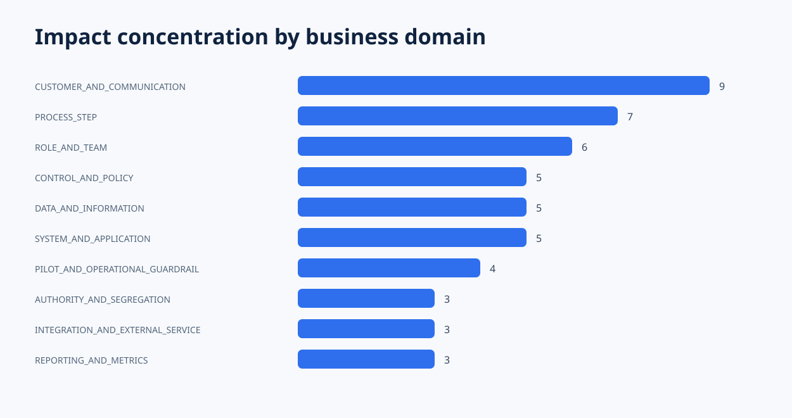

# Business Change Impact Agent

[](https://github.com/DameurMounir/business-change-impact-agent/actions/workflows/ci.yml)

[](LICENSE)
[](LICENSE-DATA)



> **Decision question:** What changes directly and indirectly?

A controlled public business-analysis case study that traces an authorised change package through a typed business graph, separates direct impacts from dependency-propagated impacts, preserves uncertainty and evidence gaps, exposes multi-change collisions, and requires digest-bound human review before a packet is confirmed.

This repository does **not** execute change, modify a production system, allocate staff or budget, select a vendor, accept risk, or decide go-live.

## Verified frozen-case result

The provider-free baseline analyses the fictional AtlasBridge onboarding change package containing eight authorised components, 64 evidence statements, 77 typed entities and 166 evidence-linked relationships. The committed result contains:

| Result | Verified count | Meaning |
|---|---:|---|
| Direct impacts | **36** | Explicitly modified, introduced, replaced, automated, resequenced or controlled by a change component |
| Indirect impacts | **12** | Reached only through published forward propagation rules and exact evidence |
| Conditional impacts | **3** | Supported paths that retain an assumption or unresolved evidence gap |
| Explicitly unaffected | **6** | Negative-control entities explicitly excluded by the authorised package |
| Multi-change collisions | **22** | One impacted entity reached from more than one change component, counted once |
| Blocked candidate claims | **5** | Unknown, reversed, over-depth, evaluator-leaking or authority-escalating claims rejected fail-closed |
| Proposed obligations | **53** | Evidence-linked follow-up proposals awaiting human authority |

These figures are evidence for one frozen synthetic case. They are not proof that every impact has been discovered in a real organisation or that the change should proceed.

## Direct versus indirect



`CC-03 — Parallel independent checks` directly changes the workflow orchestration system. A supported indirect chain then continues:

```text
CC-03
  --MODIFIES-->          Workflow orchestration system
  --CALLS_INTERFACE-->   Screening interface
  --INTEGRATES_WITH-->   Screening integration
  --DEPENDS_ON_SERVICE-> External screening service
```

The external service is classified **CONDITIONAL**, not automatically confirmed, because the final relationship carries the vendor-capacity assumption and evidence gap. The supplier beyond it is blocked because a fifth edge would exceed the published four-edge boundary.

## Impact Room



The preview above is generated from the committed result; it is not a captured production screen. The local Streamlit application exposes overview metrics, direct, indirect and conditional registers, collisions, exact paths, evidence references, obligations and digest-bound human review.

```bash
uv sync --all-extras
uv run streamlit run streamlit_app.py
```

No model provider or API key is required.

## Architecture and authority



The default adapter is deterministic and provider-free. An adapter may propose a result, but `ImpactAnalysisService` recomputes and verifies the evidence-authoritative graph output. Divergent or malformed adapter output fails closed.



Human review supports four terminal actions:

- `CONFIRM` — confirm the exact digest;
- `REQUEST_REVISION` — return the packet for correction;
- `EDIT` — confirm with bounded attention-tier or review-note edits only;
- `REJECT` — reject the packet.

Review challenges are expiring, single-use and digest-bound. Stale digests, replay, superseded challenges and concurrent double confirmation are rejected. The event ledger is hash-linked and tampering is detectable.

## BSA method

The case demonstrates a reusable senior BSA sequence:

1. freeze the authorised change components and authority boundary;
2. model business capabilities, process steps, roles, systems, data, controls, communications, tests, suppliers, assumptions and gaps;
3. record typed directional relationships with exact source evidence;
4. classify explicit direct impacts;
5. propagate only through versioned rules within the depth boundary;
6. keep conditional impacts and unsupported claims separate;
7. identify collisions, attention reasons and bounded obligations;
8. require human confirmation before a confirmed export;
9. preserve JSON, Markdown and safe HTML equivalence through one snapshot digest.

See [the detailed BSA method](docs/06-public-case-study/bsa-method.md).

## Quickstart

Requirements: Python 3.12 or 3.13 and `uv`.

```bash
git clone https://github.com/DameurMounir/business-change-impact-agent.git
cd business-change-impact-agent
uv sync --all-extras --frozen

uv run business-change-impact-agent validate
uv run business-change-impact-agent analyse \
  --output artifacts/analysis.json \
  --db artifacts/impact-room.sqlite3 \
  --run-id atlasbridge-001
```

Issue a review challenge:

```bash
uv run business-change-impact-agent review-init \
  --db artifacts/impact-room.sqlite3 \
  --analysis artifacts/analysis.json \
  --run-id atlasbridge-001
```

Use the returned `analysis_digest` and one-time `nonce`:

```bash
uv run business-change-impact-agent review \
  --db artifacts/impact-room.sqlite3 \
  --run-id atlasbridge-001 \
  --analysis-digest '<DIGEST>' \
  --nonce '<NONCE>' \
  --reviewer 'Mounir Dameur' \
  --action CONFIRM \
  --comment 'Synthetic case review only; no go-live decision.'

uv run business-change-impact-agent export \
  --db artifacts/impact-room.sqlite3 \
  --run-id atlasbridge-001 \
  --output-dir artifacts/exports

uv run business-change-impact-agent verify-ledger \
  --db artifacts/impact-room.sqlite3
```

Run the complete local demonstration, including one rejected stale review attempt and equivalent exports:

```bash
uv run business-change-impact-agent demo --workspace artifacts/demo
```

## Evidence model

The frozen public case contains:

- eight authorised change components;
- 64 evidence statements across eight fictional documents;
- 77 typed entities across 33 entity types;
- 166 typed relationships;
- three explicit assumptions and three evidence gaps;
- six explicitly unaffected negative controls;
- one prompt-injection-style evidence statement classified as untrusted data.

Every direct and indirect path carries relationship IDs and exact evidence references. Keyword similarity and document co-location are never impact authority.

## Impact concentration



The heatmap is generated from the committed analysis. It shows where the synthetic package concentrates attention; it is not a production risk score.

## Honest evaluation

The isolated evaluator-only answer key reports exact agreement for the committed deterministic contract:

| Class | Precision | Recall | F1 |
|---|---:|---:|---:|
| Direct | 1.000 | 1.000 | 1.000 |
| Indirect | 1.000 | 1.000 | 1.000 |
| Conditional | 1.000 | 1.000 | 1.000 |
| Explicitly unaffected | 1.000 | 1.000 | 1.000 |

All eight required adversarial block reason codes are exercised. **This is frozen-case contract correctness, not general model accuracy.** Live-model evaluation is `NOT_RUN` in v0.1.0.

See [the evaluation contract](docs/05-evaluation-and-safety/evaluation-contract.md) and [limitations](docs/05-evaluation-and-safety/limitations.md).

## Engineering and security evidence

The release gate performs:

- case, manifest and generated-artifact drift verification;
- Python 3.12 and 3.13 CI;
- branch-aware test coverage of at least 90%;
- Ruff formatting and linting;
- strict MyPy checking;
- Bandit high-severity scanning;
- detect-secrets and custom public-boundary scans;
- dependency audit;
- wheel and source-distribution build and inspection;
- evaluator-answer-key exclusion from runtime and packages;
- clean-wheel smoke analysis;
- local Markdown-link validation.

Security tests cover path traversal, symlinks, tampering, cycles, reversal, depth overflow, missing evidence, stale review, nonce expiry and replay, concurrency, event-ledger tampering and HTML escaping.

## Six preserved milestones

| Branch | Proof delivered |
|---|---|
| `01-case-and-evidence` | Frozen synthetic change package, evidence, typed graph, manifest and evaluator boundary |
| `02-impact-models` | Direct/indirect/conditional semantics, versioned propagation, attention and obligation contracts |
| `03-agent-and-controls` | Provider-neutral boundary, deterministic analysis and fail-closed output verification |
| `04-working-impact-room` | CLI, SQLite review protocol, event ledger, equivalent exports and Streamlit Impact Room |
| `05-evaluation-and-safety` | Isolated evaluation, adversarial tests, packaging, CI and complete release gate |
| `06-public-case-study` | Visual public case study, diagrams, demo script, metadata and verified release evidence |

Branches remain available after normal merge commits so the repository history shows controlled evolution rather than one undifferentiated code drop.

## Connected transformation portfolio

| Repository | Business question |
|---|---|
| [`requirements-quality-agent`](https://github.com/DameurMounir/requirements-quality-agent) | Are the requirements buildable? |
| [`stakeholder-alignment-agent`](https://github.com/DameurMounir/stakeholder-alignment-agent) | What is agreed, disputed or undecided? |
| [`process-redesign-agent`](https://github.com/DameurMounir/process-redesign-agent) | What future process offers the best measurable trade-off? |
| **`business-change-impact-agent`** | **What changes directly and indirectly?** |
| `go-live-decision-agent` | Is there enough evidence to proceed: PASS, BLOCKED or FAIL? |

Together they tell one controlled transformation story:

```text
Review requirements → Align stakeholders → Redesign process → Assess impacts → Decide go-live
```

## Limitations

- The organisation, evidence and outputs are fictional and synthetic.
- The engine cannot infer a relationship absent from the graph and rulebook.
- An entity not listed as impacted is not automatically proven unaffected.
- Conditional impacts remain unresolved until their assumptions and gaps are closed.
- Attention tiers are transparent prioritisation rules, not probability or accepted risk.
- The Streamlit preview is local; no hosted deployment is claimed.
- No live-model benchmark is claimed.
- Human review confirms an assessment packet, not implementation or go-live.

## Documentation

- [Public case study](docs/06-public-case-study/case-study.md)
- [BSA method](docs/06-public-case-study/bsa-method.md)
- [Five-minute demonstration script](docs/06-public-case-study/demo-script.md)
- [Architecture](docs/03-agent-and-controls/architecture.md)
- [Threat model](docs/03-agent-and-controls/threat-model.md)
- [Review protocol](docs/04-working-impact-room/review-protocol.md)
- [Export contract](docs/04-working-impact-room/export-contract.md)
- [Evaluation contract](docs/05-evaluation-and-safety/evaluation-contract.md)
- [Research foundations](docs/06-public-case-study/research-foundations.md)

## Licence

Code is licensed under [Apache License 2.0](LICENSE). The committed fictional evidence pack and generated public case-study data are covered by [CC BY 4.0](LICENSE-DATA). Third-party names used for research references remain the property of their respective owners.
